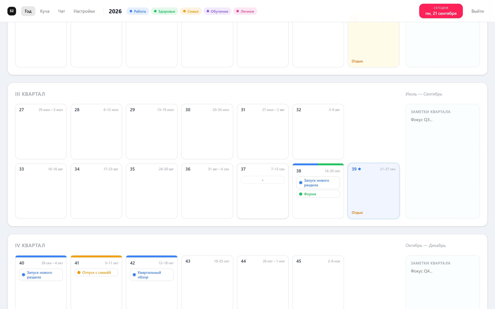
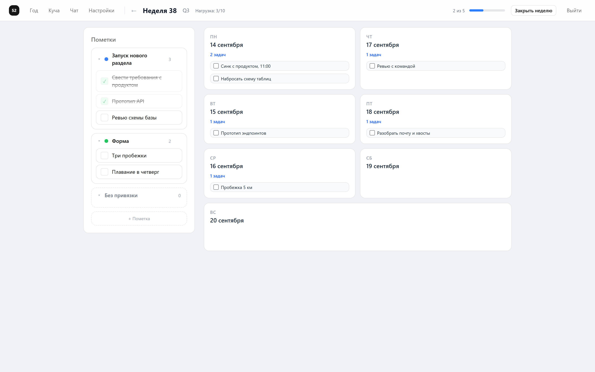
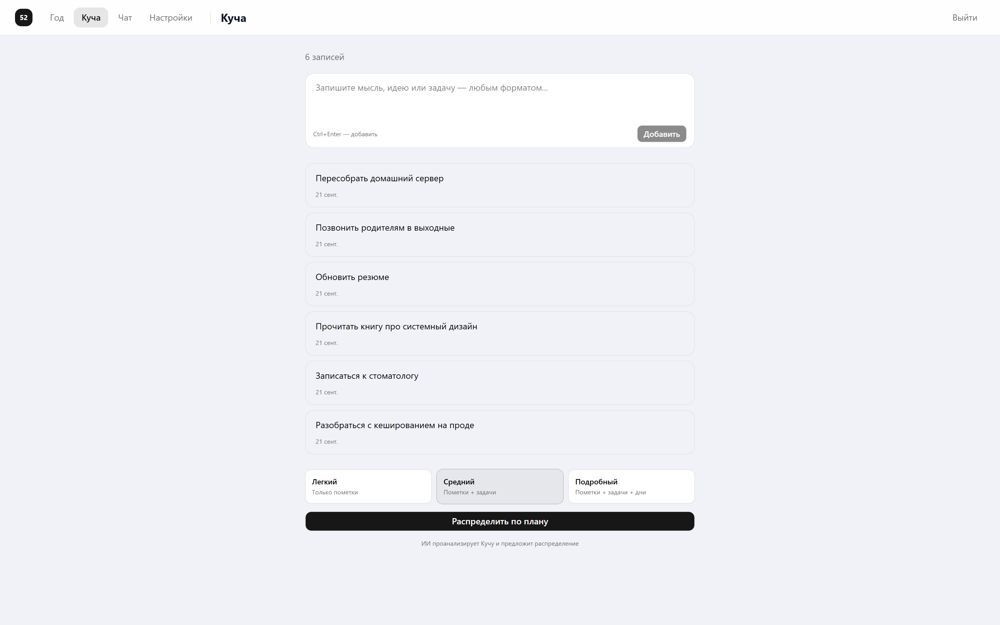

# Календарь 52

Веб-приложение для годового планирования по методологии Weekly Thinking: год делится
на 52 недели и три уровня — **Год** (стратегия), **Неделя** (тактика), **День** (операции).
Встроенный ИИ-помощник разбирает свободный текст на задачи, раскладывает их по неделям
и помогает подводить итоги недели.

FastAPI + PostgreSQL на бэкенде, React 19 + TypeScript на фронтенде, развёртывание в Docker Compose.

### Сетка года

52 недели, разбитые на кварталы. Цветная полоса сверху карточки — темы запланированных
пометок, синяя рамка — текущая неделя, жёлтая — неделя отдыха.



### Неделя

Слева пометки с вложенными задачами, справа — дни с задачами дня. В шапке счётчик
загрузки и прогресс по закрытым задачам.



### Куча

Нераспределённые записи и выбор глубины, на которую ИИ разложит их по плану.



## Что умеет

**Планирование на трёх уровнях.** Год — сетка из 52 недель, разбитая на 4 квартала по
13 недель (12 рабочих + 1 на отдых), с заметкой к каждому кварталу. Неделя — пометки
(крупные направления) и задачи, привязанные к пометкам. День — задачи внутри недели,
опционально связанные с задачей недели.

**Счётчик загрузки.** У каждой недели хранится `cached_load` — число незакрытых задач.
Пересчитывается при создании, смене статуса, удалении и переносе задачи, поэтому сетка
года сразу показывает, какие недели перегружены.

**Куча (pile).** Место для мыслей, которые ещё не разложены по плану. ИИ анализирует
записи вместе с текущей загрузкой недель, темами пользователя и календарём и предлагает
распределение на выбранную глубину — пометка, пометка + задачи недели или до задач дня.
Предложение показывается до применения, пользователь подтверждает его целиком.

**ИИ-чат над планом.** Помощник видит весь план от текущей недели и через tool use
предлагает конкретные операции: перенести, удалить, создать задачу, сменить статус.
Операции возвращаются структурой и применяются только после подтверждения.

**Ритуал закрытия недели.** Пользователь проставляет финальные статусы, пишет свободную
рефлексию, ИИ структурирует её в достижения / уроки / корректировки и предлагает, что
делать с незакрытыми задачами — перенести или отпустить.

**Мягкое удаление.** Пометки и задачи не удаляются физически: ставится `is_deleted`
и `deleted_at`, из выдачи они пропадают. История плана остаётся в базе.

## Стек

| Слой | Технологии |
|---|---|
| Бэкенд | Python 3.12, FastAPI, SQLAlchemy 2.0 (async), Alembic, Pydantic v2 |
| База | PostgreSQL 16, asyncpg |
| Аутентификация | fastapi-users, JWT в httpOnly-куке |
| ИИ | Anthropic API, tool use со строгими JSON-схемами |
| Фронтенд | React 19, TypeScript, Vite, TanStack Query, Tailwind 4, shadcn/ui, dnd-kit |
| Инфраструктура | Docker Compose, nginx, GitHub Actions |

## Архитектура

```
React (nginx :80) ──► FastAPI (:8000) ──► PostgreSQL 16
                           │
                           └──► Anthropic API (чат, распределение, рефлексия)
```

Модель данных:

```
User ──┬── Settings          (бюджет недели, режим отдыха)
       ├── Theme             (цветные темы: Работа, Здоровье, ...)
       ├── Pile ── PileItem  (нераспределённые записи)
       └── Year ──┬── QuarterNote
                  └── Week ──┬── WeekMark ── WeekTask ── DayTask
                             └── WeeklyReview
```

Всё принадлежит пользователю по цепочке `Week → Year → User`. Роутеры получают объекты
только через `app/core/ownership.py`: эти функции делают join до `Year.user_id` и отдают
404 и на отсутствующий объект, и на чужой — чтобы по коду ответа нельзя было узнать,
существует ли чужая запись. Прямой `session.get(Model, id)` в роутерах использовать
нельзя, он не проверяет владельца.

## Быстрый старт

Нужны Python 3.12, Node 22 и PostgreSQL 16 (или Docker).

```bash
git clone https://github.com/adjapsandal/Calendar_52.git
cd Calendar_52
```

**Бэкенд:**

```bash
cd backend
python -m venv .venv && source .venv/bin/activate   # Windows: .venv\Scripts\activate
pip install -r requirements.txt
cp .env.example .env        # заполнить DATABASE_URL, SECRET_KEY, ANTHROPIC_API_KEY
alembic upgrade head
uvicorn app.main:app --reload
```

API поднимется на `http://localhost:8000`, интерактивная документация — на `/docs`.

**Фронтенд:**

```bash
cd frontend
npm install
npm run dev
```

Откроется `http://localhost:5173`. При регистрации автоматически создаются год на 52 недели,
пять тем по умолчанию и настройки — заполнять ничего не нужно.

### Переменные окружения

Полный список — в [`backend/.env.example`](backend/.env.example).

| Переменная | Назначение |
|---|---|
| `DATABASE_URL` | Асинхронное подключение (`postgresql+asyncpg://...`), используется приложением |
| `DATABASE_URL_SYNC` | Синхронное (`postgresql+psycopg2://...`), используется Alembic |
| `SECRET_KEY` | Подпись JWT. Сгенерировать: `python -c "import secrets; print(secrets.token_urlsafe(32))"` |
| `JWT_LIFETIME_SECONDS` | Время жизни сессии, по умолчанию 30 дней |
| `ANTHROPIC_API_KEY` | Ключ для ИИ-функций. Без него работает всё, кроме чата, распределения и рефлексии |
| `APP_ENV` | При `production` кука выставляется с флагом `Secure` |
| `CORS_ORIGINS` | Разрешённые источники через запятую |

Секреты в репозиторий не коммитятся: `.env` в `.gitignore`, в `.env.example` только имена
переменных и заглушки.

## Развёртывание

```bash
cp backend/.env.example .env.production   # заполнить боевыми значениями
./deploy.sh
```

`deploy.sh` подтягивает изменения, пересобирает образы, прогоняет миграции и
перезапускает сервисы. Compose поднимает три контейнера: PostgreSQL с healthcheck
и постоянным томом, бэкенд на uvicorn в два воркера, фронтенд — статика, собранная
многостадийным Dockerfile и отдаваемая nginx на порту 8080.

## Тесты

```bash
cd backend
pip install -r requirements-dev.txt
pytest -q          # 27 тестов
ruff check .
```

Тесты идут по HTTP через `httpx.ASGITransport` — без поднятия сервера, но через все
зависимости, включая аутентификацию. База — SQLite в файле, схема пересоздаётся на каждый
тест. Настоящие вызовы к Anthropic API в тестах не выполняются.

Покрыты три группы:

- **`test_auth.py`** — регистрация, вход, отказ анонимному запросу, корректность сида
  (52 недели, 4 недели отдыха, темы, настройки).
- **`test_planning.py`** — основной сценарий: пометки и задачи, нумерация позиций,
  пересчёт `cached_load` при смене статуса и удалении, перенос задачи между неделями,
  мягкое удаление, каскадное и раздельное удаление пометки, 404 вместо 500 на
  несуществующем и на некорректном UUID.
- **`test_ownership.py`** — разграничение доступа между двумя пользователями: 10 проверок
  на то, что чужие недели, пометки, задачи, темы и ритуалы недоступны ни на чтение,
  ни на запись.

CI на GitHub Actions гоняет на каждый push и pull request две джобы: бэкенд
(`ruff` + `pytest`) и фронтенд (`eslint` + `tsc` + production-сборка).

## Структура

```
backend/
  app/
    api/          10 роутеров, 32 эндпоинта
    core/         конфигурация, БД, аутентификация, проверки владения, сид, клиент ИИ
    models/       модели SQLAlchemy и миксины (UUID, timestamps, soft delete)
    schemas/      схемы Pydantic
  alembic/        миграции
  tests/          pytest + httpx
frontend/
  src/
    api/          клиент axios и типы ответов
    hooks/        обёртки TanStack Query, включая оптимистичные обновления
    features/     страницы по доменам: year, week, day, pile, review, chat, auth
    components/   общие компоненты и shadcn/ui
```
